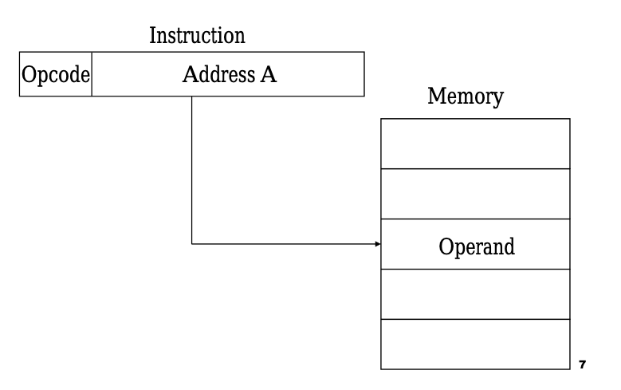
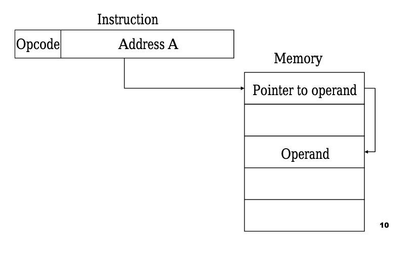
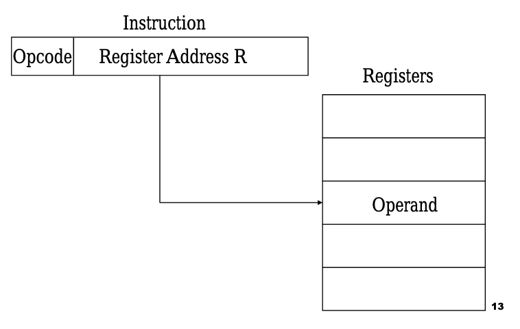
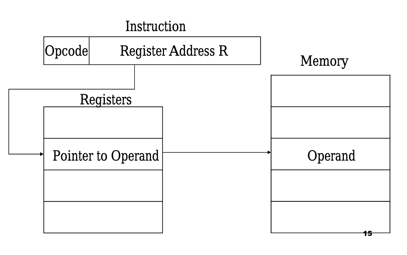

# 3. 명령어
## 고급 언어와 저급 언어
프로그램에 저장된 명령어는 프로그래밍 언어를 이용해 작성된 것이다. 프로그래밍 언어에는 **저급 언어**(Low-level Programming Language)와 **고급 언어**(High-level Programming Language)가 있는데, 기계에 가까울수록 저급이라고 표현하며, 사람에게 가까울수록 고급이라고 표현한다. 다시 말해 저급 언어는 컴퓨터가 이해하기 쉬운 언어이며, 고급 언어는 사람이 이해하기 쉬운 언어라고 할 수 있다.

컴퓨터와 가깝냐, 사람과 가깝냐에 따라 프로그래밍 언어의 수준을 나눈다.

이전 시간에 살펴봤듯 명령어도 이진수로 구성된다. 그래서 0과 1로 이루어진 언어를 **기계어**(Machine Language)라고 한다. 하지만 사람이 기계어를 읽기에는 굉장히 힘들기 때문에 이와 1:1로 대응되는 **어셈블리어**(Assembly Language)가 있다. 이 두 언어는 저급 언어에 속하며, 이 외의 C, C++, C#, Java, Javascript, Python 등 모든 언어는 고급 언어다. 예시를 하나 보도록 하자.

왼쪽은 기계어, 오른쪽은 어셈블리어다.

왼쪽 이미지와 오른쪽 이미지 모두 같은 프로그램이다. 기계어는 아예 사람이 읽을 수 없고, 어셈블리어는 그나마 기계어보다는 낫지만 그래도 꽤 복잡하다.

고급 언어에 속하는 C언어다. 

위 프로그램은 아까 본 기계어, 어셈블리어로 작성된 프로그램과 똑같은 동작을 한다. 확실히 저급 언어에 비해 작성과 읽기가 굉장히 쉽다는 것을 알 수 있다.

## 컴파일과 인터프리트
현대의 프로그램은 거의 대부분 고급 언어를 이용해 작성되지만*, 프로그램을 실행하려면 결국 고급 언어로 작성된 코드를 저급 언어로 변환하는 과정이 필요하다. 고급 언어를 저급 언어로 변환하는 방법에는 2가지가 있다. 바로 **컴파일**(Compile)과 **인터프리트**(Interpret)다.

컴파일은 코드 전체를 저급 언어로 변환하는 것인데, 이는 **컴파일러**(Compiler)라는 프로그램을 통해 처리된다. 컴파일러는 코드를 분석하며 문법 오류는 없는지, 실행 가능한 코드인지, 실행하는 데 불필요한 코드는 없는지 등을 검사하며 변환한다. 만약 컴파일 중 오류가 하나라도 발견되면 컴파일을 실패하게 된다. 인터프리트는 이와 달리 코드 전체를 변환하는 과정을 거치지 않고, 일단 실행 후 코드를 한 줄씩 그때그때 변환한다. 그래서 만약 코드에 오류가 있다면 오류를 일으키는 코드를 해석하기 전까진 코드를 쭉 실행하며, 비로소 오류가 존재하는 코드에 도달해야 변환이 실패하게 된다. 마찬가지로 인터프리트를 하는 프로그램이 있는데, 이를 **인터프리터**(Interpreter)라고 한다.
 * 임베디드 개발자, 게임 개발자, 정보 보안 등 하드웨어와 가까운 프로그래머는 저급 언어를 사용하기도 한다. 왜냐하면 어셈블리어를 읽으면 컴퓨터가 프로그램을 어떤 과정으로 실행하는지 가장 근본적인 단계에서부터 하나하나 추적하고 관찰할 수 있어 고성능 프로그램이나 찾기 어려운 오류를 발견할 수 있기 때문이다.

코드*를 작성한 후 이를 실행 가능한 프로그램으로 만드는 과정을 **빌드**(Build)라고 하는데, 빌드 중 컴파일이 필요한 언어를 **컴파일 언어**(Compiled Language), 인터프리트가 필요한 언어를 **인터프리트 언어**(Interpreted Language)라고 한다. 두 언어는 개발에 있어서도 차이점을 가지는데, 컴파일 언어는 코드 전체를 변환해야 하기에 빌드 시간이 다소 걸리지만 실행이 빠르고, 인터프리트 언어는 빌드 시간이 짧지만 실행이 다소 느리다. 다만, 이를 무 가르듯 양단할 순 없으며 일부 언어는 두 과정이 동시에 존재하기도 한다.**
 * 작성된 파일을 소스 코드(Source Code) 혹은 소스 파일(Source Flie)이라 한다.
** C#, Java 등이 있다.

## 연산 코드와 오퍼랜드
명령어는 '어떤 동작을 해라, 무엇을 대상으로'라는 구조로 이뤄진다. 전문 용어로 표현하면 **연산 코드**(OP Code; Operation Code)*와 **오퍼랜드**(Operand)**로 구성된다고 한다. 
 * 연산자(Operator)라고도 한다. 명령어 중 연산 코드가 저장되는 영역을 연산 코드 필드라고 한다.
** 피연산자라고도 한다. 명령어 중 오퍼랜드가 저장되는 영역을 오퍼랜드 필드라고 한다.

한 줄 한줄이 명령어다. 빨간색이 연산 코드고, 초록색이 오퍼랜드다. 

연산 코드는 여러 가지가 있고, 이는 하드웨어마다 다르다.* 따라서 대표적인 종류만 알아보도록 하자.
* 이를 명령어 세트(Instruction Set)라고 한다. 여기에는 [x86](https://www.felixcloutier.com/x86/)과 [ARM](https://developer.arm.com/documentation/dui0068/b/ARM-Instruction-Reference)이 있다.

- 데이터 전송
    - MOVE : 데이터를 옮긴다.
    - STORE : 메모리에 데이터를 저장한다.
    - LOAD(FETCH) : 메모리에서 CPU로 데이터를 불러온다.
    - PUSH : 데이터를 스택에 저장한다.
    - POP : 데이터를 스택에서 가져온다.
- 산술/논리 연산
    - ADD / SUBTRACT / MULTIPLY / DIVIDE : 사칙연산을 수행한다.
    - INCREMENT / DECREMENT : 1을 더한다. / 1을 뺀다.
    - AND / OR / NOT : 논리 연산을 한다.
    - COMPARE : 비교한다.
- 제어 흐름 변경
    - JUMP : 특정 주소로 실행 순서를 옮긴다.
    - CONDITIONAL JUMP : 조건에 부합할 때 특정 주소로 실행 순서를 옮긴다.
    - HALT : 프로그램의 실행을 멈춘다.
    - CALL : 함수를 호출한다.
    - RETURN : 함수를 끝낸다.
- 입출력 제어
    - READ(INPUT) / WRITE(OUTPUT) : 특정 입출력 장치로부터 데이터를 읽는다. / 쓴다.
    - START IO : 입출력 장치를 시작한다.
    - TEST IO : 입출력 장치의 상태를 확인한다.

각 연산 코드마다 필요한 오퍼랜드의 개수는 다르다. 그래서 오퍼랜드의 개수에 따라 0-주소 명령어, 1-주소 명령어, 2-주소 명령어, 3-주소 명령어 등으로 분류하기도 한다. 주소라는 명칭이 붙은 이유는, 오퍼랜드에 숫자나 문자 등을 나타내는 <u>데이터</u>나 메모리 혹은 레지스터 <u>주소</u>가 저장되는데, 대부분의 경우 메모리 혹은 레지스터 주소가 담기기 때문이다.*
* 그래서 주소 필드(Address Field)라고도 한다.

## 주소 지정 방식
오퍼랜드에 직접 데이터를 표현하면 제약이 생긴다. 가령 명령어가 16비트로 구성 되고, 이중 4비트를 연산 코드 필드로 부여하면, 4비트만큼 데이터를 표현하지 못하게 된다. 따라서 대다수의 명령어의 오퍼랜드 필드에는 주소가 저장되고, 그 주소를 통해 연산의 대상이 되는 실제 데이터에 접근한다. 실제 데이터가 저장된 주소를 **유효 주소**(Effective Address)라고 하는데, 유효 주소를 찾는 방법을 **주소 지정 방식**(Addressing Mode)라고 한다. 주소 지정 방식에는 여러 가지가 있지만 이중 몇 가지만 알아보자.

### 즉시 주소 지정 방식
**즉시 주소 지정 방식**(Immediate Addressing Mode)는 데이터를 오퍼랜드 필드에 직접 명시하는 방식이다. 표현할 수 있는 데이터의 크기가 작아지지만, 메모리에 접근하지 않아도 되기에 다른 주소 지정 방식보다 빠르다.

오퍼랜드 필드에 데이터가 직접적으로 표현된다.

### 직접 주소 지정 방식
**직접 주소 지정 방식**(Direct Addressing Mode)은 유효 주소를 명시하는 방식이다. 즉시 주소 지정 방식이 데이터를 표현하는 데 제약이 있는 것처럼 즉시 주소 지정 방식도 표현할 수 있는 유효 주소에 제한이 있다.

데이터가 저장된 메모리 주소가 오퍼랜드 필드에 표현된다.

### 간접 주소 지정 방식
**간접 주소 지정 방식**(Indirect Addressing Mode)은 유효 주소가 저장된 메모리 주소를 명시하는 방식이다. 직접 주소 지정 방식보다 표현할 수 있는 유효 주소의 범위가 넓지만, 2번의 메모리 접근이 필요하기 때문에 즉시 주소 지정 방식 혹은 직접 주소 지정 방식보다 일반적으로 느리다.

실제 데이터에 접근하려면 메모리에 2번 접근해야 한다.

### 레지스터 주소 지정 방식
**레지스터 주소 지정 방식**(Register Addressing Mode)은 레지스터가 유효 주소인 것이다. 메모리에 접근하지 않아도 되기에 직접 주소 지정 방식보다 빠르게 데이터에 접근 가능하다. 다만, 표현할 수 있는 레지스터 개수에는 제한이 있다.

메모리가 아니라 레지스터에 데이터가 있는 것이다.

### 레지스터 간접 주소 지정 방식
**레지스터 간접 주소 지정 방식**(Register Indirect Addressing Mode)은 레지스터에 유효 주소가 저장된 것이다. 간접 주소 지정 방식과 비교해서 메모리 접근이 1번 줄었기 때문에 비교적 빠르다.

레지스터를 통해 유효 주소를 얻어 메모리에 접근한다.

# 참고자료
- https://www.investopedia.com/terms/a/assembly-language.asp
- https://ko.wikipedia.org/wiki/어셈블리어#어셈블러
- https://en.wikipedia.org/wiki/Addressing_mode
- https://www.researchgate.net/publication/328491965_Addressing_Modes