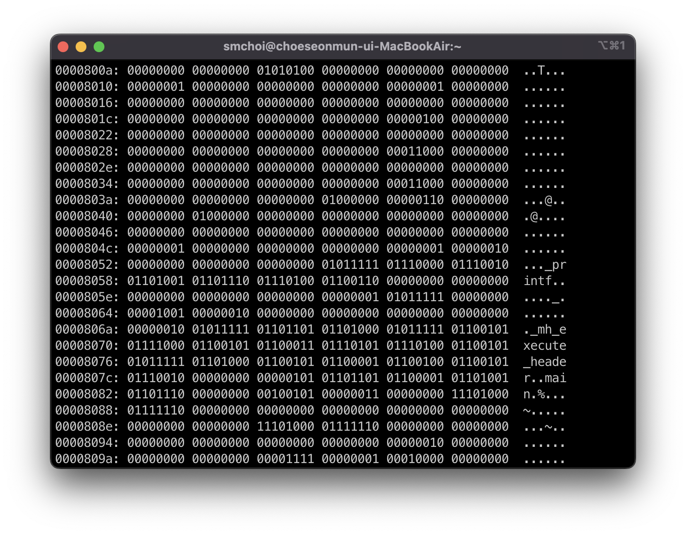
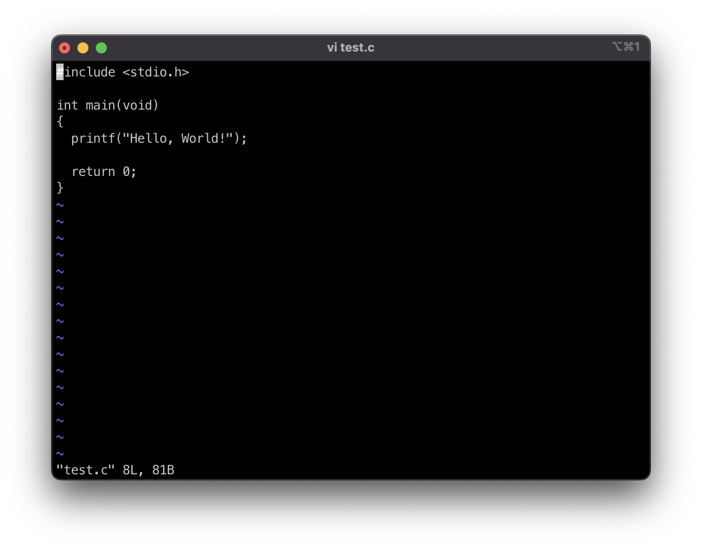
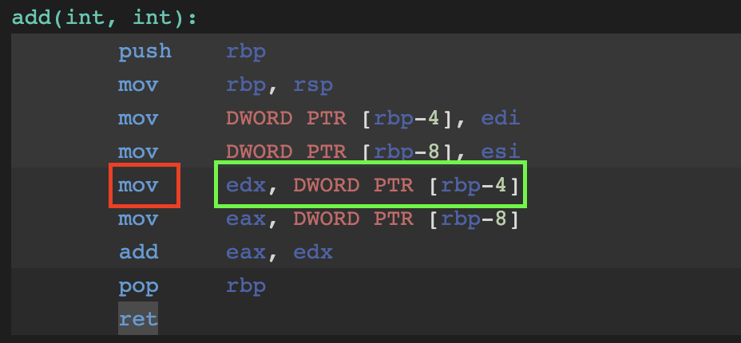
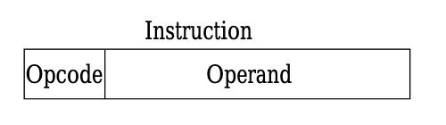

# 3. 명령어
## 고급 언어와 저급 언어
컴퓨터가 어떤 동작을 하기 위해서 우리는 컴퓨터에게 어떤 것을 실행해야 할지 알려줘야 한다. 다시 말해 명령어를 작성해야 한다. 프로그래머는 프로그래밍 언어를 이용해 명령어를 작성하게 된다. 프로그래밍 언어에는 저급 언어(Low-level Programming Language)와 고급 언어(High-level Programming Language)가 있는데, 이는 기계에 가까운지, 사람에게 가까운지를 기준으로 나누게 된다. 즉, 저급 언어는 컴퓨터가 직접 이해하고 실행할 수 있는 언어이며, 고급 언어는 사람을 위한 언어라고 할 수 있다.

이전 시간에 살펴봤듯 컴퓨터의 정보는 이진수로 이뤄진다. 이는 명령어도 이진수로 이뤄져 있다는 것이다. 그래서 0과 1로 이루어진 언어를 기계어(Machine Code)라고 한다. 

기계어는 0과 1로 이루어진 언어다.

보다시피 기계어는 읽기가 굉장히 어렵다. 그래서 과거에는 기계어와 1:1로 대응되는 언어인 어셈블리어(Assembly Language)를 통해 프로그램을 작성했다.

어셈블리어는 기계어를 읽기 편한 형태로 바꾼 것이다.

그래서 저급 언어에는 기계어와 어셈블리어가 속한다. 이 외의 C, C++, C#, Java, Javascript, Python 등 모든 언어는 고급 언어다.

C언어로 작성된 프로그램 

## 컴파일과 인터프리트
현대의 프로그램은 거의 대부분 고급 언어를 이용해 작성한다.* 하지만, 컴퓨터는 앞서 말했듯 기계어로 된 프로그램만을 실행할 수 있다. 따라서 고급 언어로 작성된 프로그램은 어떤 과정을 거쳐 어셈블리어로 번역해야 하고, 어셈블리어를 기계어로 대응시키는 과정을 거쳐 최종적으로 실행할 수 있는 프로그램이 된다.
* 이 파일을 소스 코드(Source Code) 혹은 소스 파일(Source Flie)이라 한다.

고급 언어를 저급 언어로 변환하는 방법에는 2가지가 있다. 바로 컴파일(Compile)과 인터프리트(Interpret)다. 컴파일은 코드 전체를 저급 언어로 변환하는 과정인데, 이는 컴파일러(Compiler)라는 프로그램을 통해 처리된다. 컴파일러는 코드를 분석하며 문법 오류는 없는지, 실행 가능한 코드인지, 실행하는 데 불필요한 코드는 없는지 등을 검사하며 변환한다. 만약 컴파일 중 오류가 하나라도 발견되면 컴파일을 실패하게 된다.

인터프리트는 이와 달리 코드 전체를 변환하는 과정을 거치지 않고, 일단 실행 후 코드를 한 줄 한줄 그때그때 변환한다. 그래서 만약 코드에 오류가 있다면 오류를 일으키는 코드를 해석하기 전까진 코드를 쭉 실행하며, 비로소 오류가 존재하는 코드에 도달해야 변환이 실패하게 된다. 

코드로 실행 프로그램을 만드는 과정을 빌드(Build)라고 하는데, 빌드 중 컴파일이 필요한 언어를 컴파일 언어(Compile Language), 인터프리트가 필요한 언어를 인터프리트 언어(Interpret Language)라고 한다. 다만, 이를 무 가르듯 양단할 순 없으며 일부 언어는 두 과정이 동시에 존재하기도 한다.

## C++, C#, Python의 빌드 과정
현대 프로그램을 제작할 때 자주 사용되는 언어인 C++, C#, Python을 기준으로 빌드 과정을 이해해보도록 하자.

### C++
C++의 빌드는 아래와 같다.

## C언어의 컴파일 과정
- 전처리기(Preprocessor)
    - 
- 컴파일러
- 어셈블러
- 링커

### C#
C#의 빌드는 아래와 같다.

### Python
Python의 빌드는 아래와 같다.

- 고급 언어와 저급 언어
      - 어셈블리어(Assembly Language) : 기계어를 읽기 편한 형태로 번역한 언어
            - 어셈블리어를 읽으면 컴퓨터가 프로그램을 어떤 과정으로 실행하는지, 즉 프로그램이 어떤 절차로 작동하는지를 가장 근본적인 단계에서부터 하나하나 추적하고 관찰할 수 있다.
        - 하드웨어와 밀접하게 맞닿아 있는 프로그램을 개발하는 임베디드 개발자, 게임 개발자, 정보 분야 등의 개발자가 주로 이용
    - 고급 언어로 작성된 소스코드가 실행되려면 반드시 저급 언어, 즉 명령어로 변환되어야 한다.

- 컴파일 언어와 인터프리터 언어
    - 고급 언어를 저급 언어로 바꾸는 방법
        - 컴파일(Compile)
            - 컴파일러(Compiler)가 수행함. 컴파일러는 문법 오류는 없는지, 실행 가능한 코드인지, 실행하는 데 불필요한 코드는 없는지 등을 따지며 변환함. 오류를 하나라도 발견하면 해당 소스 코드는 컴파일에 실패함.
            
        - 인터프리트(Interpret)
            - 변환 시간을 기다릴 필요는 없지만 그때그때마다 해석해야 하는 시간이 있어 실행이 느림

- 링킹(Linking) : 소스 코드를 연결하는 것

-  컴파일러를 통해 저급 언어로 변환된 코드를 목적 코드(Object Code)라고 함.
                - 원시 코드
## 연산 코드와 오퍼랜드
명령어는 '어떤 동작을 해라, 무엇을 대상으로'라는 구조로 이뤄진다. 전문 용어로 표현하면 연산 코드(OP Code; Operation Code)*와 오퍼랜드(Operand)**로 구성된다고 한다. 
* 연산자(Operator)라고도 한다. 명령어 중 연산 코드가 저장되는 영역을 연산 코드 필드라고 한다.
** 피연산자라고도 한다. 명령어 중 오퍼랜드가 저장되는 영역을 오퍼랜드 필드라고 한다.

한 줄 한줄이 명령어다. 빨간색이 연산 코드고, 초록색이 오퍼랜드다. 

연산 코드는 여러 가지가 있고, 이는 하드웨어마다 다르다.* 따라서 대표적인 종류만 알아보도록 하자.
* 이를 명령어 세트(Instruction Set)라고 한다. 여기에는 [x86](https://www.felixcloutier.com/x86/)과 [ARM](https://developer.arm.com/documentation/dui0068/b/ARM-Instruction-Reference)이 있다.

- 데이터 전송
    - MOVE : 데이터를 이동한다.
    - STORE :
    - LOAD(FETCH)
    - PUSH
    - POP
- 산술/논리 연산
    - ADD / SUBTRACT / MULTIPLY / DIVIDE : 사칙연산을 수행한다.
    - INCREMENT / DECREMENT : 1을 더한다. / 1을 뺀다.
    - AND / OR / NOT : 논리 연산을 한다.
    - COMPARE : 
- 제어 흐름 변경
    - JUMP / CONDITIONAL JUMP
    - HALT
    - CALL
    - RETURN
- 입출력 제어
    - READ(INPUT) / WRITE(OUTPUT)
    - START IO
    - TEST IO

각 연산 코드마다 필요한 오퍼랜드의 개수는 다르다. 그래서 오퍼랜드의 개수에 따라 0-주소 명령어, 1-주소 명령어, 2-주소 명령어, 3-주소 명령어 등으로 분류하기도 한다. 주소라는 명칭이 붙은 이유는, 오퍼랜드에 숫자나 문자 등을 나타내는 데이터나 메모리 혹은 레지스터 주소가 저장되는데, 대부분의 경우 메모리 혹은 레지스터 주소가 담기기 때문이다.*
* 그래서 주소 필드(Address Field)라고도 한다.

## 주소 지정 방식
오퍼랜드에 직접 데이터를 표현하면 제약이 생긴다. 가령 명령어가 16비트로 구성 되고, 이중 4비트를 연산 코드 필드로 부여하면, 4비트만큼 데이터를 표현하지 못하게 된다. 따라서 대다수의 명령어의 오퍼랜드 필드에는 주소가 저장되고, 그 주소를 통해 연산의 대상이 되는 실제 데이터에 접근한다. 실제 데이터가 저장된 주소를 유효 주소(Effective Address)라고 하는데, 유효 주소를 찾는 방법을 주소 지정 방식(Addressing Mode)라고 한다. 주소 지정 방식에는 아래와 같이 분류된다.

TODO : Wiki 토대로 코드와 데이터를 기준으로 주소 모드 정리

### 즉시 주소 지정 방식
즉시 주소 지정 방식(Immediate Addressing Mode)는 데이터를 오퍼랜드 필드에 명시하는 방식이다. 표현할 수 있는 데이터의 크기가 작아지지만, 메모리에 접근하지 않아도 되기에 다른 주소 지정 방식보다 빠르다.

mov ax, 42 # AX 레지스터에 42를 저장해라

<!-- 이미지 -->

### 직접 주소 지정 방식
직접 주소 지정 방식(Direct Addressing Mode)은 오퍼랜드 필드에 유효 주소를 직접적으로 명시하는 방식이다. 직접적으로 명시하기 때문에 그만큼 표현할 수 있는 유효 주소에 제한이 있다.

mov ax, [0x1000] # AX 레지스터에 1000번지를 저장해라

<!-- 이미지 -->

### 간접 주소 지정 방식
간접 주소 지정 방식(Indirect Addressing Mode)은 유효 주소가 저장된 주소를 오퍼랜드 필드에 명시하는 방식이다. 직접 주소 지정 방식보다 표현할 수 있는 유효 주소의 범위가 넓지만, 2번의 메모리 접근이 필요하기 때문에 즉시 주소 지정 방식 혹은 직접 주소 지정 방식보다 일반적으로 느리다.

<!-- 이미지 -->

### 레지스터 주소 지정 방식
레지스터 주소 지정 방식(Register Addressing Mode)은 오퍼랜드 필드에 레지스터를 명시하는 방식이다. 메모리에 접근하지 않아도 되기에 직접 주소 지정 방식보다 빠르게 데이터에 접근 가능하다. 
            
            - 표현할 수 있는 레지스터 크기에 제한이 생김 ?

push rbp
<!-- 이미지 -->

### 레지스터 간접 주소 지정 방식
레지스터 간접 주소 지정 방식(Register Indirect Addressing Mode)은 유효 주소가 저장된 레지스터를 명시하는 방식이다. 간접 주소 지정 방식과 비교해서 메모리 접근이 1번 줄었기 때문에 비교적 빠르다.

<!-- 이미지 -->

1. 즉시 모드(Immediate Mode)
- 오퍼랜드가 명령어에 제공됨
- MOV AX, 42

2. 레지스터 모드(Register Mode)
- 오퍼랜드가 레지스터에 저장됨
- MOV AX, BX

3. 직접/절대 주소 모드(Direct/Absolute Mode)
- 오퍼랜드가 저장된 메모리 주소 표시 => 유효 주소 표시
- MOV AX, [0x1000]

4. 간접 주소 모드(Indirect Mode)
- 유효 주소가 저장된 레지스터나 메모리 주소 표시
- MOV AX, [BX]

5. 인덱스 모드(Indexed Mode)
Indexed mode allows adding an offset to a base address using an index register. For example, "MOV AX, [SI+10]" will move the value from the memory address stored in SI register plus an offset of 10 into the AX register.

6. 상대 주소 모드(Relative Mode)
- PC로부터 오프셋을 명시함
- jmp
In this mode, the operand is specified as an offset relative to the current instruction pointer or program counter. Commonly used in branch instructions, e.g., "JMP label" where the CPU jumps to a specific location (label) relative to the current instruction pointer.

7. Base-Plus-Offset Mode:
- 베이스 플러스 오프셋..
This mode combines a base register value with an offset to access memory. For example, "MOV AX, [BX+10]" will move the value at memory address BX+10 into the AX register.

Different CPUs and architectures may support various combinations of addressing modes, and each mode has its advantages and use cases. The choice of addressing mode can significantly impact program performance and memory usage. Assembler programmers need to understand these modes to optimize their code for a given architecture and task.

- 어셈블리어에서 자주 보이는 모드
    - 즉시 지정
    - 레지스터 모드
    - 레지스터 간접 모드
    - 베이스 플러스 오프셋 모드
    - 상대 주소 모드
- 그 외
    - 직접 주소 모드
    - 간접 주소 모드

4. 상대 주소 모드 ?
5. 베이스 플러스 오프셋..

# 참고자료
- https://www.investopedia.com/terms/a/assembly-language.asp
- https://ko.wikipedia.org/wiki/어셈블리어#어셈블러
- https://en.wikipedia.org/wiki/Addressing_mode#CPUs_that_do_not_use_sequential_execution

main:
        push    %rbp
        mov     %rbp, %rsp
        mov     DWORD PTR [%rbp-20], 1      # immediate
        lea     %rax, [%rbp-20]             # base-plus-offset
        mov     QWORD PTR [%rbp-16], %rax   # register
        mov     %rax, QWORD PTR [%rbp-16]   # base-plus-offset
        mov     %eax, DWORD PTR [%rax]      # register indirect
        mov     DWORD PTR [%rbp-4], %eax
        mov     %eax, DWORD PTR [%rbp-20]
        test    %eax, %eax
        jne     .L5                         # relative
        mov     DWORD PTR [%rbp-20], 20
.L5:
        leave
        ret
        