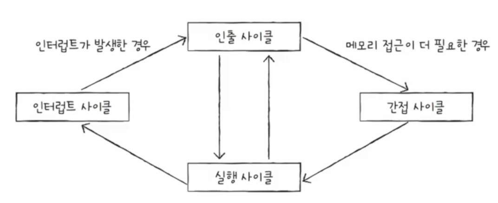

# 4. CPU의 작동 원리
CPU의 구성 요소를 하나씩 깊이 관찰해보며 동작 원리에 대해 파헤쳐보자.

## ALU
ALU는 제어장치로부터 어떤 연산을 수행하라는 제어 신호와 레지스터로부터 오퍼랜드를 입력 받아 다양한 연산을 수행한다. 연산을 수행할 수 있는 이유는 이를 위한 여러 가지 논리 회로가 ALU 내부에 있기 때문이다. 덧셈을 위한 가산기, 뺄셈을 위한 보수기, 시프트 연산을 위한 시프터 등 이러한 논리 회로 등이 얽히고 섥혀 연산을 수행하게 되는 것이다. 연산에 따라 결괏값과 플래그가 발생할 수 있고, 이러한 정보는 레지스터에 저장된다.

도식화된 ALU

물론 실제로는 이러한 회로로 구성되어 있다.

## 제어장치
제어장치는 제어 신호를 내보내기 때문에 CPU의 구성 요소 중 가장 정교하게 설계된 부품이다. CPU 제조사마다 제어장치의 구현 방식이나 명령어를 해석하는 방식, 받아들이고 내보내는 정보에는 조금씩 차이가 있다.

도식화된 제어장치

받아들이는 정보 중 대표적인 것은 4가지다. 첫 번째는 클럭 신호(Clock Signal)로, 컴퓨터 내 모든 회로의 동작을 똑같이 맞추기 위한(동기화) 신호를 말한다*. 두 번째는 해석할 명령어다. 이를 받아들인 후, 제어 신호를 생성한다. 세 번째는 플래그 값이다. 제어 신호를 생성할 때 참고한다. 마지막으로 제어 버스를 통해 전달된 제어 신호다. 입출력 장치 등 CPU 외부에 위치한 부품들로부터 발생한 제어 신호도 받으며, 이 또한 제어 신호를 생성할 때 참고한다. 

 * 메인보드 내 클럭 생성기(Clock Generator)에 의해 만들어진다.

생성된 제어 신호는 CPU 내부 혹은 외부에 전달된다. CPU 내부로는 ALU에 수행할 연산을 지시하거나 레지스터에 저장된 데이터 전송을 목적으로 전달하며, CPU 외부로는 메모리나 입출력장치에 읽기 혹은 쓰기를 하기 위해 제어 버스를 통해 전달한다.

제어 장치 또한 실제로는 이러한 회로로 구성된다. 좌상단이 입력되는 정보이며, 하단이 생성된 제어 신호다.

## 레지스터
레지스터는 오퍼랜드 혹은 명령어 등 여러 가지 정보를 저장하기 위한 메모리다. 명령어 집합마다 필요한 레지스터가 모두 다르지만, 대표적인 종류만 살펴보도록 한다.*
* ARM 혹은 x86 아키텍처의 레지스터 종류가 궁금하다면 [여기](https://github.com/kangtegong/self-learning-cs/blob/main/registers/registers.md)를 참고해보자.

### 프로그램 카운터
프로그램 카운터(PC; Program Counter)는 명령어의 주소가 저장되는 레지스터다. 다른 말로 명령어 포인터(IP; Instruction Pointer)라고도 한다.

### 명령어 레지스터
제어장치가 받아들이는 정보 중 해석할 명령어가 있다고 했는데, 이 정보가 저장되는 레지스터가 명령어 레지스터(IR; Instruction Register)다.

### 메모리 주소 레지스터
메모리 주소 레지스터(MAR; Memory Address Register)에는 메모리의 주소가 저장된다. 메모리로부터 데이터를 불러올 경우에 사용하는데, 주소 버스를 통해 메모리에게 이 주소를 전달하여 해당 주소의 데이터를 꺼내오게 한다.

### 메모리 버퍼 레지스터
메모리로부터 가져온 데이터나 메모리에 저장할 데이터는 메모리 버퍼 레지스터(MBR; Memory Buffer Register)에 저장된다. 메모리 주소 레지스터에 저장된 정보는 주소 버스를 거쳤던 것처럼 메모리 버퍼 레지스터에 저장된 혹은 저장될 정보는 데이터 버스를 거친다. 다른 말로 메모리 데이터 레지스터(MDR; Memory Data Register)라고도 한다.

### 플래그 레지스터
연산 결과 혹은 CPU 상태에 대한 부가적인 정보를 플래그(Flag)라고 헀다. 플래그 레지스터(Flag Register)에는 이러한 플래그가 비트로 구분되어 저장된다. 몇 가지만 살펴보자면 아래와 같다.

| 플래그 종류 | 의미 | 카테고리 | 1인 경우 | 0인 경우 |
| --- | --- | --- | --- | --- | --- |
| 부호 플래그 | 연산한 결과의 부호를 나타낸다. | 상태 | 음수 | 양수 |
| 제로 플래그 | 연산 결과가 0인지 여부를 나타낸다. | 상태 | 0임 | 0이 아님 |
| 캐리 플래그 | 연산 결과 올림수나 빌림수가 발생했는지를 나타낸다. | 상태 | 발생 | 발생하지 않음 |
| 오버플로우 플래그 | 오버플로우*가 발생했는지를 나타낸다. | 상태 | 발생 | 발생하지 않음 |
| 인터럽트 플래그 | 인터럽트가 가능한지를 나타낸다. | 제어 | 가능 | 불가능 |
| 슈퍼바이저 플래그 | 커널 모드인지, 사용자 모드인지 나타낸다.** | 시스템 | 커널 모드 | 사용자 모드 |

* 오버플로우(Overflow) : 연산 결과가 연산 결과를 담을 레지스터보다 큰 상황을 말한다.

** 운영체제 때 자세하게 다루게 된다.

- 범용 레지스터(General Purpose Register)
    - CPU가 임시값을 저장하기 위해 사용하는 레지스터

- 스택 포인터(SP; Stack Pointer)
    - 스택에 마지막으로 저장한 값의 위치(Top)를 저장하는 레지스터
    - 스택 주소 지정 방식에 사용
        - 스택 영역을 사용함.
- 베이스 레지스터(Base Register)

- 변위 주소 지정 방식(Displacement Addressing Mode)
    - 오퍼랜드에 저장된 변위와 특정 레지스터의 값을 더하여 유효 주소를 얻어내는 방식
    - 상대 주소 지정 방식(Relative Addressing Mode)
        - 오퍼랜드와 프로그램 카운터의 값을 더하여 유효 주소를 얻음
        - 분기문이 나올 때 사용
    - 베이스 레지스터 주소 지정 방식(Base-register Addressing Mode)
        - 오퍼랜드와 베이스 레지스터의 값을 더하여 유효 주소를 얻음

## 4-3. 명령어 사이클과 인터럽트
- 명령어 사이클(Instruction Cycle)
    - 하나의 명령어를 처리하는 정형화된 흐름

    <!-- 각 사이클이 어떻게 일어나는지 .. -->
    1. 인출 사이클(Fetch Cycle) : 메모리로부터 명령어를 CPU로 가져옴
    2. 실행 사이클(Execution Cycle) : 명령어를 해석하고 제어 신호 발생시킴
    3. 간접 사이클(Indirect Cycle) : 메모리 접근이 필요한 경우
    4. 인터럽트 사이클(Interrupt Cycle) 
- 인터럽트(Interrupt)
    - 명령어 사이클의 흐름이 끊어지는 상황 / CPU의 작업을 방해하는 신호
    - 종류
        - 동기 인터럽트(Synchronous Interrupts)
            - CPU에 의해 발생하는 인터럽트
            - CPU가 명령어들을 수행하다가 예상치 못한 상황에 마주쳤을 때, 가령 CPU가 실행하는 프로그램 상 오류와 같은 예외적인 상황에 마주쳤을 때 발생하는 인터럽트
            - 예외가 발생하면 예외를 처리함.
            - 예외(Exception)라고도 함.
                - 폴트(Fault)
                    - 예외를 처리한 직후 예외가 발생한 명령어부터 실행을 재개
                    - Ex. 필요한 데이터가 보조기억장치에 있는 경우
                - 트랩(Trap)
                    - 예외를 처리한 직후 예외가 발생한 명령어의 다음 명령어부터 실행을 재개
                    - Ex. 디버깅
                - 중단(Abort)
                    - 실행 중인 프로그램을 강제로 중단시킬 수밖에 없는 심각한 오류
                - 소프트웨어 인터럽트(Software Interrupt)
                    - 시스템 호출이 발생

        - 비동기 인터럽트(Asynchronous Interrupts)
            - 주로 입출력장치에 의해 발생하는 인터럽트
            - 알림 역할을 함.
            - 하드웨어 인터럽트
                1. 입출력장치는 CPU에 인터럽트 요청 신호를 보낸다.
                2. CPU는 실행 사이클이 끝나고 명령어를 인출하기 전 항상 인터럽트 여부를 확인한다.
                3. CPU는 인터럽트 요청을 확인하고 인터럽트 플래그를 통해 현재 인터럽트를 받아들일 수 있는지 여부를 확인한다.
                4. 인터럽트를 받아들일 수 있다면 CPU는 지금까지의 작업을 스택에 백업한다.
                5. CPU는 인터럽트 벡터를 참조하여 인터럽트 서비스 루틴을 실행한다.            
                6. 인터럽트 서비스 루틴 실행이 끝나면 (4)에서 백업해 둔 작업을 복구하여 실행을 재개한다.
            - 막을 수 있는 인터럽트(Maskable Interrupt)와 막을 수 없는 인터럽트(Non Maskable Interrupt)가 있음.
                - 막을 수 없는 인터럽트는 인터럽트 플래그가 비활성화 되어 있더라도 무시함.
                - 정전이나 하드웨어 고장 등
    - 인터럽트 서비스 루틴(ISR; Interrupt Service Routine)
        - 인터럽트를 처리하기 위한 프로그램
        - 메모리에 저장됨.
        - 인터럽트 핸들러(Interrupt Handler)라고도 함.
    - 인터럽트 벡터(Interrupt Vector)
        - ISR을 식별하기 위한 정보로 각 ISR의 시작 주소가 저장됨.
            - 인터럽트 핸들러는 입출력장치마다 다르기 때문
        - 요청을 보낸 대상으로부터 데이터 버스를 통해 인터럽트 벡터를 전달 받음.

# 참고자료
- https://github.com/kangtegong/self-learning-cs/blob/main/registers/registers.md
- https://en.wikipedia.org/wiki/Arithmetic_logic_unit
- https://en.wikipedia.org/wiki/Clock_signal
- https://en.wikipedia.org/wiki/FLAGS_register