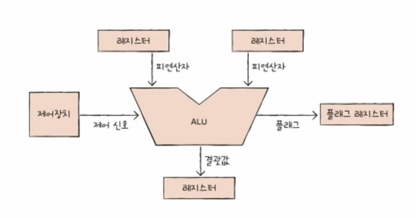
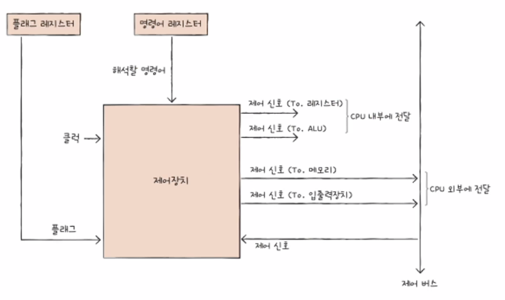
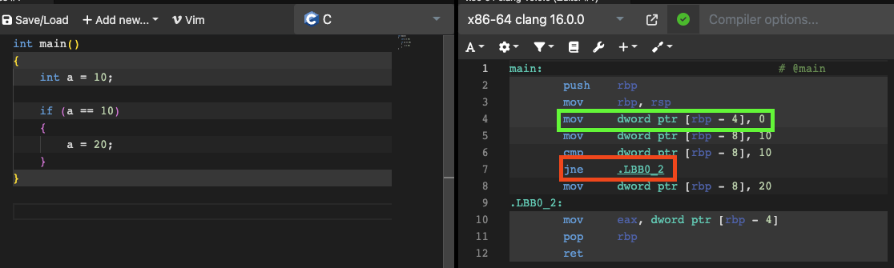
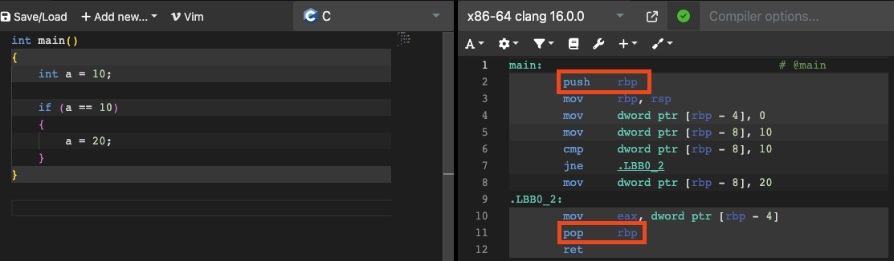

# 4. CPU의 작동 원리
앞서 살펴본 CPU의 구성 요소를 하나씩 깊이 관찰해보고 동작 원리에 대해서 알아보도록 한다.

## ALU
ALU는 제어장치로부터 어떤 연산을 수행하라는 제어 신호와 레지스터로부터 오퍼랜드를 입력 받아 다양한 연산을 수행한다. 연산을 수행할 수 있는 이유는 이를 위한 여러 가지 논리 회로가 ALU 내부에 있기 때문이다. 덧셈을 위한 가산기, 뺄셈을 위한 보수기, 시프트 연산을 위한 시프터 등 이러한 논리 회로 등이 얽히고 섥혀 연산을 수행하게 되는 것이다. 연산에 따라 결괏값과 플래그가 발생할 수 있고, 이러한 정보는 레지스터에 저장된다.

도식화된 ALU

물론 실제로는 이러한 회로로 구성되어 있다.

## 제어장치
제어장치는 제어 신호를 내보내기 때문에 CPU의 구성 요소 중 가장 정교하게 설계된 부품이다. CPU 제조사마다 제어장치의 구현 방식이나 명령어를 해석하는 방식, 받아들이고 내보내는 정보에는 조금씩 차이가 있다.

도식화된 제어장치

받아들이는 정보 중 대표적인 것은 4가지다. 첫 번째는 **클럭 신호**(Clock Signal)로, 컴퓨터 내 모든 회로의 동작을 똑같이 맞추기 위한(동기화) 신호를 말한다*. 두 번째는 **해석할 명령어**다. 이를 받아들인 후, 제어 신호를 생성한다. 세 번째는 **플래그** 값이다. 제어 신호를 생성할 때 참고한다. 마지막으로 **제어 버스를 통해 전달된 제어 신호**다. 입출력 장치 등 CPU 외부에 위치한 부품들로부터 발생한 제어 신호도 받으며, 이 또한 제어 신호를 생성할 때 참고한다. 
 * 메인보드 내 클럭 생성기(Clock Generator)에 의해 만들어진다.

생성된 제어 신호는 CPU 내부 혹은 외부에 전달된다. CPU 내부로는 ALU에 수행할 연산을 지시하거나 레지스터에 저장된 데이터 전송을 목적으로 전달하며, CPU 외부로는 메모리나 입출력장치에 읽기 혹은 쓰기를 하기 위해 제어 버스를 통해 전달한다.

제어 장치 또한 실제로는 이러한 회로로 구성된다. 좌상단이 입력되는 정보이며, 하단이 생성된 제어 신호다.

## 레지스터
레지스터는 오퍼랜드 혹은 명령어 등 여러 가지 정보를 저장하기 위한 메모리다. 명령어 집합마다 필요한 레지스터가 모두 다르지만, 대표적인 종류만 살펴보도록 한다.*
* ARM 혹은 x86 아키텍처의 레지스터 종류가 궁금하다면 [여기](https://github.com/kangtegong/self-learning-cs/blob/main/registers/registers.md)를 참고해보자.

### 프로그램 카운터
**프로그램 카운터**(PC; Program Counter)는 명령어의 주소가 저장되는 레지스터다. 다른 말로 **명령어 포인터**(IP; Instruction Pointer)라고도 한다.

### 명령어 레지스터
제어장치가 받아들이는 정보 중 해석할 명령어가 있다고 했는데, 이 정보가 저장되는 레지스터가 **명령어 레지스터**(IR; Instruction Register)다.

### 메모리 주소 레지스터
**메모리 주소 레지스터**(MAR; Memory Address Register)에는 메모리의 주소가 저장된다. 메모리로부터 데이터를 불러올 경우에 사용하는데, 주소 버스를 통해 메모리에게 이 주소를 전달하여 해당 주소의 데이터를 꺼내오게 한다.

### 메모리 버퍼 레지스터
메모리로부터 가져온 데이터나 메모리에 저장할 데이터는 **메모리 버퍼 레지스터**(MBR; Memory Buffer Register)에 저장된다. 메모리 주소 레지스터에 저장된 정보는 주소 버스를 거쳤던 것처럼 메모리 버퍼 레지스터에 저장된 혹은 저장될 정보는 데이터 버스를 거친다. 다른 말로 **메모리 데이터 레지스터**(MDR; Memory Data Register)라고도 한다.

### 플래그 레지스터
연산 결과 혹은 CPU 상태에 대한 부가적인 정보를 플래그라고 헀다. 플래그 레지스터(Flag Register)에는 이름처럼 플래그가 비트로 구분되어 저장된다. 몇 가지만 살펴보자면 아래와 같다.

| 플래그 종류 | 의미 | 카테고리 | 1인 경우 | 0인 경우 |
| --- | --- | --- | --- | --- | --- |
| 부호 플래그 | 연산한 결과의 부호를 나타낸다. | 상태 | 음수 | 양수 |
| 제로 플래그 | 연산 결과가 0인지 여부를 나타낸다. | 상태 | 0임 | 0이 아님 |
| 캐리 플래그 | 연산 결과 올림수나 빌림수가 발생했는지를 나타낸다. | 상태 | 발생 | 발생하지 않음 |
| 오버플로우 플래그 | 오버플로우*가 발생했는지를 나타낸다. | 상태 | 발생 | 발생하지 않음 |
| 인터럽트 플래그 | 인터럽트가 가능한지를 나타낸다. | 제어 | 가능 | 불가능 |
| 슈퍼바이저 플래그 | 커널 모드인지, 사용자 모드인지 나타낸다.** | 시스템 | 커널 모드 | 사용자 모드 |
* 오버플로우(Overflow) : 연산 결과가 연산 결과를 담을 레지스터보다 큰 상황을 말한다.
** 운영체제 때 자세하게 다루게 된다.

### 변위 주소 지정 방식에 사용되는 레지스터
저번에 미처 다루지 못한 주소 지정 방식이 있다. 주소 지정 방식에 대해서 다시 한번 상기해보자면 오퍼랜드의 유효 주소를 어떻게 명령어에 표현할 것인지 그 방법을 일컬었다. **변위 주소 지정 방식**(Displacement Addressing Mode)은 오퍼랜드에 저장된 변위와 특정 레지스터의 값을 더하여 유효 주소를 얻어내는 방식이다.

변위 주소 지정 방식은 레지스터와 변위를 조합해 유효 주소를 얻어낸다.

변위 주소 지정 방식은 2가지로 다시 분류할 수 있다. 첫 번째로 오퍼랜드와 프로그램 카운터의 값을 더하여 유효 주소를 얻는 **상대 주소 지정 방식**(Relative Addressing Mode)이 있고, 두 번째로 오퍼랜드와 베이스 레지스터의 값을 더하여 유효 주소를 얻는 베이스 레지스터 주소 지정 방식(Base-register Addressing Mode)이 있다.

변위 주소 지정 방식은 자주 쓰이는 주소 지정 방식이다. 빨간색이 상대 주소 지정 방식, 초록색이 베이스 레지스터 주소 지정 방식이다.

### 스택 포인터
**스택 포인터**(SP; Stack Pointer)는 스택*에 마지막으로 저장한 값의 위치**를 저장하는 레지스터다. 변위 주소 지정 방식처럼 스택 포인터를 활용하는 주소 지정 방식도 있는데, 이를 **스택 주소 지정 방식**(Stack Addressing Mode)라 한다. 다시 말해 스택 포인터가 유효 주소를 저장하고 있는 것이다.
 * 스택은 프로세스 내 논리적인 영역이다. 함수 실행 시 필요한 데이터를 갖고 있다. 자세한 건 운영체제에서 다룬다.
 ** 스택의 위(Top)라고 한다.

빨간색이 스택 주소 지정 방식이 사용된 명령어다.

### 범용 레지스터
그 외 CPU가 임시값을 저장하기 위해 사용하는 **범용 레지스터**(General Purpose Register)가 있다. **ISA**(Instruction Set Architecture)별로 개수는 다르다.

ARM의 레지스터 목록. 범용 레지스터가 엄청 많다는 것을 알 수 있다.

## 명령어 사이클
컴퓨터는 어떻게 명령어를 처리할까? 컴퓨터가 명령어를 처리하기 위해선 몇 가지 단계가 필요한데 이를 **명령어 사이클**(Instruction Cycle)이라 한다. 명령어 사이클에는 인출-해석-실행 단계로 구성된다.* 하나씩 살펴보자.
 * 그래서 인출-해석-실행 사이클이라고도 한다. 간단히 인출-실행 사이클로 말하기도 한다.

### 인출 단계
**인출 단계**(Fetch Stage)에서는 메모리로부터 명령어를 CPU로 가져온다. 세부 단계는 아래와 같다.

1. 다음 실행할 명령어를 프로그램 카운터에서 가져와 메모리 주소 레지스터에 저장한다.
2. 제어장치가 메모리에 읽기 요청에 관한 제어 신호를 보낸다. 이때 읽어들일 주소는 주소 버스를 통해 함께 전달된다.
3. 데이터 버스를 통해 메모리로부터 명령어가 전달되며, 이는 메모리 버퍼 레지스터에 저장된다.
4. 메모리 버퍼 레지스터에 저장된 명령어를 명령어 레지스터로 복사한다.
5. 프로그램 카운터에 저장된 값을 1 증가한다. 즉, 다음 명령어를 가리키게 된다.

### 해석 단계
**해석 단계**(Decode Stage)는 제어장치가 명령어 레지스터에 저장된 명령어를 해석하는 단계다. 이때 유효 주소를 읽어 들이게 되는데, 만약 레지스터에 오퍼랜드가 없고 메모리에 있는 경우 메모리로부터 오퍼랜드를 가져와 알맞은 레지스터로 전송한다. 메모리로부터 데이터를 읽어들이는 과정은 인출 사이클과 비슷하며, 메모리 버퍼 레지스터에 저장된 데이터를 명령어 레지스터가 아닌 범용 레지스터로 옮긴다는 점과 프로그램 카운터의 값이 증가되지 않는다는 차이점이 있다.

### 실행 단계
**실행 단계**(Execution Stage)에서는 제어장치가 해석된 정보를 ALU에 전달해 산술 혹은 논리 연산을 하도록 지시한다.* 결괏값이 있다면 메인 메모리에 저장되거나 출력 장치로 전송될 수 있다. 그리고 ALU의 피드백에 따라 프로그램 카운터의 값을 바꿔 다른 주소에서 명령어를 가져오도록 할 수 있다.**
 * 이전에 살펴봤듯 제어 신호를 발생시키는 것이다.
 ** JUMP와 같은 분기문을 실행하는 경우를 생각해보자.

## 인터럽트
어떤 문서를 프린터로 출력한다고 하자. 그럼 CPU는 프린터 기기에 이 문서를 출력해달라고 요청할 것이다. 이때 CPU는 어떻게 프린터가 출력을 완료했는지 알 수 있을까? 단순한 방법은 CPU가 주기적으로 체크하는 방법이 있다. 이를 **폴링**(Polling)이라고 한다. 하지만 CPU 자원이 낭비된다는 것을 알 수 있다. 이것보다 더 우아한 방식은 프린터가 스스로 출력을 완료했음을 CPU에게 알려주는 것이다. 현대 컴퓨터에서는 이런 방식이 구현되어 있는데, CPU의 명령어 실행을 잠시 중단시키는 신호를 **인터럽트**(Interrupt)라 한다.

### 인터럽트 시스템의 동작 방식
인터럽트 시스템의 동작은 아래와 같다.

1. 주변장치(입출력장치, 타이머 등)가 CPU에게 **인터럽트 요청**(IRQ; Interrupt Request)을 생성한다.
2. CPU는 실행 단계가 끝나고 인터럽트 요청이 있는지 확인한다.
3. 인터럽트 요청이 있을 시, 인터럽트 플래그를 확인해 현재 인터럽트를 처리할 수 있는지 확인한다. 이를 **서비스**(Service)한다고 표현한다.
4. 인터럽트를 서비스할 수 있다면 현재까지의 작업 내용을* 스택에 저장한다.
5. **인터럽트 핸들러**\*\*(Interrupt Handler)를 실행한다.
6. 인터럽트 핸들러의 실행이 끝나면 원래 작업을 복구하여 실행을 재개한다.

 * 문맥(Context)이라고 한다. 모든 레지스터 데이터와 프로세스 정보가 있는데, 상세한 것은 운영체제에서 배운다.
 ** 인터럽트 서비스 루틴(ISR; Interrupt Service Routine)이라고도 한다.

각 장치마다 발생한 인터럽트는 각각 처리되어야 하는 방식이 다르다. 그래서 장치 드라이버를 설치할 때, 인터럽트 핸들러라는 프로그램이 **인터럽트 벡터 테이블**(IVT; Interrupt Vector Table)*에 등록된다. 테이블에는 각 인터럽트 핸들러의 시작 주소가 저장되어 있으며 이를 **인터럽트 벡터**(Interrupt Vector)**라는 고유 식별 번호로 구분한다. 인터럽트 벡터는 주변장치가 인터럽트 요청을 보낼 때 데이터 버스로 전송한다.
 * 0-255까지의 범위를 가진다. 0-31까지는 ISA에 의해 예약되어 있고, 32-255까지 사용자 정의 인터럽트 핸들러를 등록할 수 있다. ARM은 [여기](https://developer.arm.com/documentation/dui0552/a/the-cortex-m3-processor/programmers-model/core-registers) Intel은 이 [문서](https://web.archive.org/web/20081221050950/http://download.intel.com/design/processor/manuals/253668.pdf) 193페이지에서 예약된 IVT 내용을 확인할 수 있다.
 ** 수학적 의미의 벡터와는 아무런 관계가 없다. 

### 인터럽트 우선순위
인터럽트 간에는 우선순위가 있기 때문에 더 중요한 인터럽트를 더 먼저 처리할 수 있다. 다시 말해 우선순위가 낮은 인터럽트를 서비스하는 인터럽트 핸들러는 우선순위가 더 높은 인터럽트 발생시 일시 중단될 수 있다.

### 인터럽트 마스크
인터럽트에는 **막을 수 있는 인터럽트**(Maskable Interrupt)와 **막을 수 없는 인터럽트**(NMI; Non Maskable Interrupt)가 있다. 막을 수 없는 인터럽트는 가장 우선순위가 높은 인터럽트로, 인터럽트 플래그의 활성화 여부에 관계 없이 무조건 실행된다. 예시로는 정전이나 하드웨어 고장 등이 있다.

### 가상 인터럽트
운영체제는 다른 일반 프로그램들은 접근할 수 없는 물리적(하드웨어) 인터럽트에 접근할 수 있다. 그래서 이를 기반으로 **가상 인터럽트**(Virtual Interrupt)  시스템을 제공하기도 한다. 예를 들어 Unix 운영체제는 **시그널**(Signal) 매커니즘을 제공한다. 최근 개발된 시스템은 보통 이를 **이벤트**(Event)라고 부른다. 이벤트는 스레드 간 동기화에 사용한다.

### 예외
**예외**(Exception)는 CPU가 명령어를 실행하다 예상치 못한 상황에 마주쳤을 때 발생하는 인터럽트다.* 예를 들어 어떤 수를 0으로 나누려고 하거나, 시스템 호출, 명령어를 실행할 권한이 없는 경우, 필요한 데이터가 보조기억장치에 있는 경우, 읽기 전용 메모리에 쓰려고 시도하는 경우 등이 있다. 예외도 인터럽트이기 때문에 예외가 발생할 시 대응되는 인터럽트 핸들러**를 실행한다. 실행이 끝난 후에는 예외가 발생한 명령어부터 다시 실행하거나, 예외가 발생한 명령어를 건너뛰고 그다음 명령어부터 실행을 재개하거나, 프로그램이 강제 종료되기도 한다.
 * 예외를 폴트(Fault), 트랩(Trap), 중단(Abort)으로 구분하기도 한다. 하지만 이는 ISA마다 부르는 명칭이 다르다.
 ** ISA 별로 IVT의 예약된 정보를 확인해보자.
# 참고자료
- https://github.com/kangtegong/self-learning-cs/blob/main/registers/registers.md
- https://en.wikipedia.org/wiki/Arithmetic_logic_unit
- https://en.wikipedia.org/wiki/Clock_signal
- https://en.wikipedia.org/wiki/FLAGS_register
- https://slideplayer.com/slide/1508961/
- https://learn.microsoft.com/en-us/windows-hardware/drivers/kernel/introduction-to-interrupt-service-routines
- https://en.wikipedia.org/wiki/Interrupt_vector_table
- https://www.studytonight.com/computer-architecture/addressingmodes-instructioncycle
- https://www.sciencedirect.com/topics/computer-science/general-purpose-register
- https://en.wikipedia.org/wiki/Instruction_set_architecture
- https://stackoverflow.com/questions/45538021/how-to-know-if-a-register-is-a-general-purpose-register
- https://en.wikipedia.org/wiki/Instruction_cycle
- https://velog.io/@embeddedjune/FreeRTOS-%EC%A0%95%EB%A6%AC-3.-%EB%AC%B8%EB%A7%A5%EC%A0%84%ED%99%98%EA%B3%BC-%EC%9D%B8%ED%84%B0%EB%9F%BD%ED%8A%B8-Context-Switching-Interrupt
- https://product.kyobobook.co.kr/detail/S000001932753
- https://web.archive.org/web/20081221050950/http://download.intel.com/design/processor/manuals/253668.pdf
- https://developer.arm.com/documentation/dui0552/a/the-cortex-m3-processor/programmers-model/core-registers