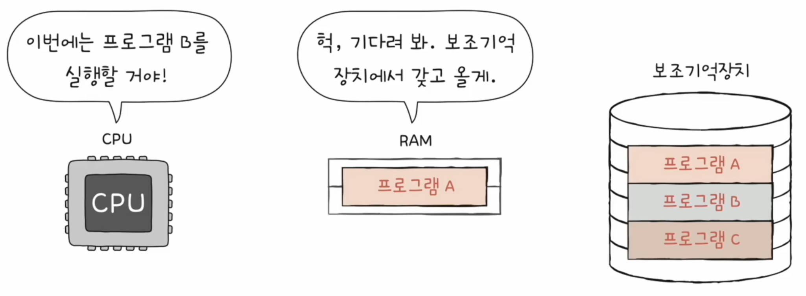
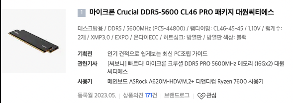
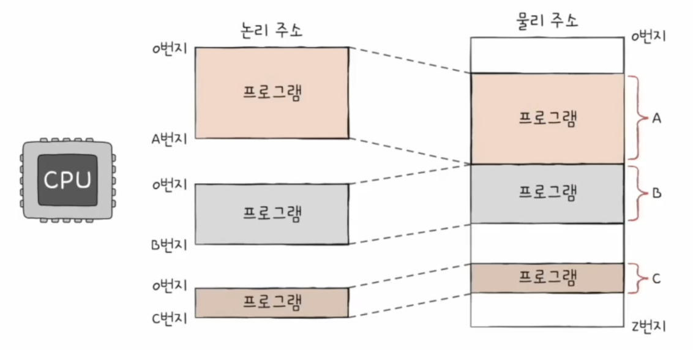
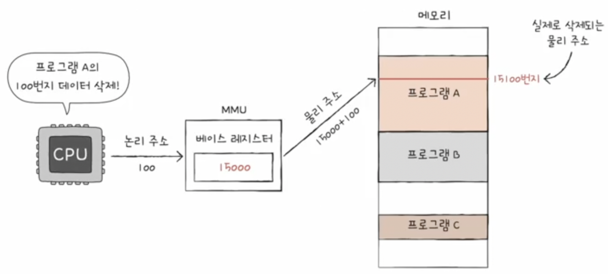
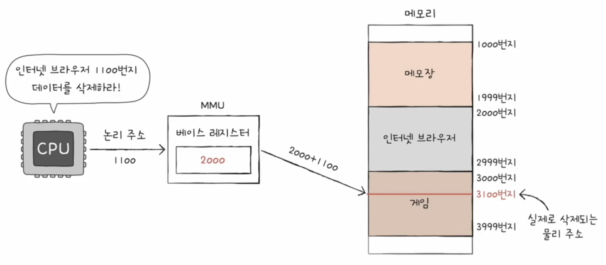
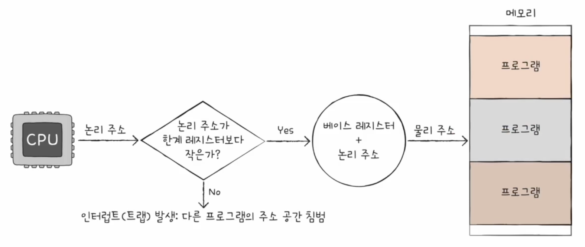

<style>
    .highlight
    {
        color: red;
    }

    .footnote
    {
        color: gray;
        font-size: 90%;
    }

    img
    {
        display: block;
        margin: auto;
    }

    .img-desc
    {
        color: gray;
        text-align: center;
        margin-bottom: 1%;
    }

    html body table
    {
        display: table;
        width: 80%;
        margin: auto;
    }
</style>

# 6. 메모리와 캐시 메모리
이번 시간에는 메모리에 대해서 자세히 알아보도록 하자.

## RAM
### 특징
[1주차](./1주차.pdf)에서 살펴봤 듯이 RAM에 저장된 데이터는 휘발된다. 그래서 컴퓨터의 전원이 꺼졌을 때도 유지되어야 하는 정보는 보조기억장치에 저장하고, 이후 그 정보를 다시 사용하고자 할 때 보조기억장치에 저장된 정보를 RAM으로 복사하여 사용한다.


<div class="img-desc">CPU가 프로그램 혹은 파일의 내용을 이용하려면 보조기억장치에서 가져와 RAM에 불러와야 한다.</div>

그렇다면 RAM의 용량이 클수록 성능에도 좋은 영향을 주리라 예상할 수 있다. RAM의 용량이 작다면 그만큼 빈번하게 보조기억장치로부터 내용을 불러와야 하기 때문에 CPU가 대기하는 시간이 늘어나게 된다. 그러나 무작정 RAM의 용량에 비례하여 성능이 증가되지는 않는다. 보조기억장치로의 접근 빈도 수는 줄겠지만, CPU가 처리할 수 있는 양은 정해져 있기 때문이다. 다시 말해 128GB의 RAM을 장착했다 하더라도 CPU의 코어가 1개 밖에 없다면 성능 향상의 상한선이 낮을 것이다.


<div class="img-desc">메모리의 크기가 단일 프로그램 성능에 크게 영향을 미치지는 않는다. 다만, 멀티태스킹에는 영향을 줄 수 있다.</div>

### 종류
RAM은 크게 DRAM(Dynamic RAM)과 SRAM(Static RAM)으로 나뉜다. DRAM은 시간이 지날수록 저장된 정보가 점점 사라지는 RAM으로 데이터의 소멸을 막기 위해 일정 주기로 데이터를 재활성화해야 한다. SRAM은 이와 다르게 저장된 데이터가 소실되지 않는 RAM이다.* 특징만 놓고 봤을 때는 SRAM이 더 좋은 것 같지만 여기에는 상충 관계가 있다. SRAM이 DRAM과 비교하여 데이터 재활성화 작업이 필요없고 속도도 비교적 더 빠르지만, 집적도가 낮아 대용량으로 설계하기 어렵고 소비 전력도 높으며 가격이 비싸다. 따라서 일반적으로 사용되는 RAM은 DRAM이며, SRAM은 후술할 캐시 메모리에 사용된다.
<span class="footnote"> * 데이터에 동적(Dynamic)으로 변화가 생기는가 혹은 데이터가 정적(Static)으로 유지되는가라는 관점에서 바라볼 수 있다.</span> 

| 특징 | DRAM | SRAM |
| --- | --- | --- |
| 재충전 | 필요함 | 필요없음 |
| 속도 | 느림 | 빠름 |
| 가격 | 저렴함 | 비쌈 |
| 집적도 | 높음 | 낮음 |
| 소비 전력 | 낮음 | 높음 |
| 사용 용도 | 주기억장치(RAM) | 캐시 메모리 |
<div class="img-desc">DRAM과 SRAM의 차이점</div>

DRAM 중에서도 현재 일반적으로 사용되는 DRAM은 DDR SDRAM(Double Date Rate Synchrounous DRAM)이다. SDRAM은 클럭 신호와 동기화되어 메모리 접근이 일어나는 DRAM이라는 것을 의미하고*, DDR은 한 클럭당 주고받을 수 있는 데이터 전송률**을 높인 것을 의미한다. 현재는 DDR5 방식까지 나와있다.
<span class="footnote"> * 과거에는 클럭과 동기되어 메모리 접근이 일어나지 않았다. 그래서 과거의 DRAM을 ADRAM(Asynchrounous DRAM)이라 한다.
** 대역폭이라 한다. 과거 한 클럭 당 하나의 데이터를 주고받을 수 있는 SDRAM을 SDR(Single Data Rate) SDRAM으로 구분지어 부르기도 한다.
</span>


<div class="img-desc">다나와에 등록되어 있는 제품 중 하나다. 이 제품은 DDR5 방식이며 동작클럭은 5600MHz임을 알 수 있다.</div>
    
## 메모리의 주소 공간
CPU는 현재 실행 중인 프로그램이 RAM의 몇 번지부터 몇 번지까지 적재 되어 있는지 알 수 없다. 왜냐하면 RAM에 저장된 정보는 여러 프로그램이 적재되고 삭제 되며 시시각각 그 내용이 변하기 때문이다. 그래서 CPU는 논리 주소(Logical Address)를 이용해 RAM에 접근하게 된다. 논리 주소는 실행 중인 각각의 프로그램에게 부여된 주소다. 즉, 각 프로그램은 각자만의 독립적인 주소를 가지며 CPU는 논리 주소를 이용해 명령어와 데이터를 읽어들이고 쓰게 되는 것이다.


<div class="img-desc">프로그램은 각자 독립적인 주소를 갖고 있으며, 0번지부터 시작한다.</div>

그림으로 볼 수 있듯 논리 주소로 실제 RAM에 접근할 순 없다. RAM에 접근하려면 정보가 실제로 저장된 주소인 물리 주소(Physical Address)로의 변환이 필요하다. 논리 주소와 물리 주소 간의 변환은 CPU와 주소 버스 사이에 위치하고 있는 하드웨어인 메모리 관리 장치(MMU; Memory Management Unit)에 의해 수행된다. MMU는 프로그램의 시작 주소를 저장하고 있는 베이스 레지스터를 이용해 논리 주소와 물리 주소 간의 변환을 처리한다.


<div class="img-desc"> MMU는 논리 주소에 베이스 레지스터 값을 더해 논리 주소를 물리 주소로 변환한다. </div>

단, 물리 주소로의 변환이 무작정 일어나는 것은 아니다. 변환된 물리 주소가 다른 프로그램의 영역을 침범할 수도 있기 때문이다. 따라서 CPU는 논리 주소를 물리 주소로 변환하기 전에 논리 주소가 유효한 범위 내에 있는지 확인한다. 확인하는 방법은 논리 주소의 최대 크기를 저장하고 있는 한계 레지스터(Limit Register)를 이용한다. 만약 변환하고자 하는 논리 주소가 한계 레지스터에 저장된 값보다 같거나 큰 경우 예외*가 발생한다.
<span class="footnote"> * 트랩이 발생한다. </span>


<div class="img-desc">위와 같이 논리 주소가 잘못됐다면 다른 프로그램을 침범할 수 있다.</div>

정리하자면 RAM에 저장된 정보는 계속 변하기 때문에 CPU는 실행 중인 프로그램의 실제 주소를 알 수 없다. 따라서 프로그램별로 독립적인 논리 주소를 사용하고 실제 RAM에 접근할 때는 MMU가 논리 주소를 물리 주소로 변환시켜 준다. 프로그램의 유효한 물리 주소 범위는 베이스 레지스터와 한계 레지스터를 이용해 구할 수 있다. 베이스 레지스터에는 프로그램의 가장 작은 물리 주소, 즉 프로그램의 첫 물리 주소가 저장되어 있으며, 한계 레지스터에는 최상단의 논리 주소가 저장된다. 그러므로 프로그램의 유효한 물리 주소 범위는 [베이스 레지스터, 베이스 레지스터 + 한계 레지스터)라고 할 수 있다. 그래서 이 둘을 활용해 잘못된 메모리 접근이 일어나지 않도록 한다.


<div class="img-desc">베이스 레지스터와 한계 레지스터로 각 프로그램의 독립적인 공간을 정의하고 보호한다.</div>

## 캐시 메모리
컴퓨터가 발전하는 내내 메모리의 속도는 CPU의 속도보다 빠른 적이 없었다. 이는 메모리에서 데이터를 읽거나 메모리에 데이터를 쓰는 경우 CPU는 그 시간 동안 아무런 작업을 하지 않는다는 것을 의미한다.* 용량도 크고 가격도 저렴하고 속도도 빠른 저장 장치가 있으면 좋겠지만 현실적인 한계로 존재하지 않는다. 그래서 [1주차](./1주차.pdf)에 작성했듯 다양한 메모리를 사용해서 이러한 속도 차이를 줄이고 있고, 이를 나타낸 계층도를 메모리 계층 구조라 한다.
<span class="footnote"> * 그래서 데이터지향 프로그래밍(DOP; Data-Oriented Programming) 패러다임이 등장하게 되었다. </span>


<div class="img-desc">프로세서와 메모리의 성능 차이</div>

[1주차](./1주차.pdf)에 잠깐 언급했던 캐시 메모리에 대해서 자세히 알아보자. 캐시 메모리는 레지스터보다는 용량이 크고 RAM보다 빠른 SRAM 기반의 저장 장치로 CPU와 RAM 사이에 위치해 메모리 접근 시간을 줄여주는 역할을 하고 있다. 캐시 메모리에는 RAM이 보조기억장치에 저장된 데이터를 저장하고 있듯, RAM의 데이터 일부를 저장하고 있다.

메모리 계층 구조에서 각 계층에 위치하는 메모리는 상위 계층의 윗 계층의 메모리로부터 읽기 혹은 쓰기 요청을 받아 처리한다. 그래서 CPU가 연산하는 데 레지스터에 데이터가 없을 경우 캐시 메모리에 읽기를 요청하며, 만약 캐시 메모리 내에 원하는 데이터가 있다면 이를 캐시 적중(Cache Hit)이라 하고, 없다면 이를 캐시 부적중(Cache Miss)이라 한다. 캐시 부적중 시 다시 하위 계층에 위치하는 메모리로부터 데이터를 가져와 저장(cache)한다. 캐시 적중 유무는 매우 중요한데 성능 병목이 결국 메모리 입출력에서 발생하기 때문이다. 따라서 고성능의 프로그램을 작성할 때에는 캐시 적중률(Cache Hit Ratio)*을 높일 수 있게 코드를 작성해야 한다. 한편, 현대 컴퓨터의 캐시 적중률은 평균 85% ~ 95% 수준이다.
<span class="footnote"> * (캐시 적중 횟수) / (캐시 적중 횟수 + 캐시 부적중 횟수)</span>

캐시 적중률에 따라 얼만큼 성능이 차이나는지 알아보기 위해 아래의 코드를 작성하여 확인해보자.
```csharp
using System.Diagnostics;

public class Program
{
    private const int SizeX = 1_000_000;
    private const int SizeY = 100;
    
    public static void Main()
    {
        var randomGenerator = new Random();
        byte[][] arr = new byte[SizeY][];
        for (int y = 0; y < SizeY; ++y)
        {
            arr[y] = new byte[SizeX];

            for (int x = 0; x < SizeX; ++x)
            {
                arr[y][x] = (byte)randomGenerator.Next(100);
            }
        }

        long ms = MeasureTime(() =>
        {
            int result = 0;
            for (int y = 0; y < SizeY; ++y)
            {
                for (int x = 0; x < SizeX; ++x)
                {
                    result += arr[y][x];
                }
            }
        });
        Console.WriteLine($"1st Case : {ms}ms");
        
        ms = MeasureTime(() =>
        {
            int result = 0;
            for (int x = 0; x < SizeX; ++x)
            {
                for (int y = 0; y < SizeY; ++y)
                {
                    result += arr[y][x];
                }
            }
        });
        Console.WriteLine($"2nd Case : {ms}ms");
    }

    private static long MeasureTime(Action action)
    {
        var stopwatch = new Stopwatch();
        
        stopwatch.Start();
        action();
        stopwatch.Stop();

        return stopwatch.ElapsedMilliseconds;
    }
}

// Output
// -------------
// 1st Case : 374ms
// 2nd Case : 415ms
```

하나하나 순차적으로 접근했던 첫 번째 로직의 경우 374ms가 나왔으며, 듬성듬성 접근했던 두 번째 로직의 경우 415ms가 나왔다. 다시 말해 두 번째 경우는 캐시 부적중이 많이 일어나 그만큼 시간이 걸린 것이라고 할 수 있다.

이런 이유로 CPU 제조사는 캐싱의 효과를 극대화할 수 있게 설계를 개선해 나갔으며 현재는 단일의 캐시 메모리가 아닌 계층적으로 캐시 메모리를 구성하고 있다. 현대 CPU의 캐시는 L1, L2, L3 총 3개의 계층으로 구성되며, 속도는 L1이 제일 빠르고 L3가 제일 느리며 용량은 L1이 제일 작고 L3가 제일 크다. 또, L1과 L2 캐시 메모리는 보통 코어 내부에 위치하며 L3는 코어 외부에 위치하여 모든 코어가 공유하여 사용하는 편이다. L1의 경우 좀 더 빠른 성능을 위해 이를 명령어와 데이터를 따로 저장할 수 있게 분리하여 사용하기도 한다.*
<span class="footnote"> * 분리형 캐시(Split Cache)라고 하며 명령어만 저장하는 캐시를 I\$, 데이터만 저장하는 캐시를 D\$라 한다.</span> 


<div class="img-desc">Intel 14th CPU의 다이샷(Die-Shot). L3, L2, L1 캐시를 확인할 수 있다.</div>

<!-- 캐시 메모리의 동작 원리-->

### 참조 지역성 원리
그럼 왜 캐시 메모리를 이용하면 성능이 향상될까? 단순히 RAM의 내용을 저장하고 있기 때문은 아니며 여기에는 과학적인 원리가 숨어있는데 바로 참조 지역성 원리(Locality of Reference, Principle of Locality)다. 선대 컴퓨터 과학자들은 연구를 통해 CPU가 메모리에 접근할 때의 경향에 대해서 알게 됐는데, (1) 최근에 접근했던 메모리 공간에 다시 접근하려는 경향과 (2) 접근한 메모리 공간 근처를 접근하려는 경향이 있다는 사실이다. 이를 각각 시간 지역성(Temporal Locality)과 공간 지역성(Spatial Locality)이라 한다.


<div class="img-desc">실행 중인 프로그램에서 메모리 접근 시점과 메모리 주소를 표시한 그래프로 여기서 시간 지역성과 공간 지역성을 확인할 수 있다.</div>

# 참고자료
- https://parksb.github.io/article/29.html
- https://www.teamgroupinc.com/kr/blogs/ram-frequency-fps-I-kr
- https://namu.wiki/w/RAM
- https://en.wikipedia.org/wiki/Random-access_memory
- https://en.wikipedia.org/wiki/Dynamic_random-access_memory
- http://gec.di.uminho.pt/discip/minf/ac0102/1000Gap_Proc-Mem_Speed.pdf
- https://wccftech.com/intel-14th-gen-meteor-lake-cpu-die-shot-redwood-cove-crestmont-cores-compute-tile/