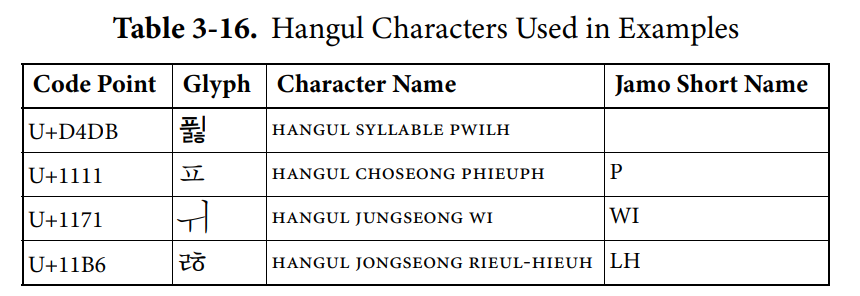

# 1. 컴퓨터 구조 시작하기

---

## 1-1. 컴퓨터 구조를 알아야 하는 이유

### 1) 문제 해결
+ 문제 상황 발생 시 단순히 문법적인 접근만이 아닌 `컴퓨터 구조`에 대한 이해를 바탕으로 다각적인 문제 해결 방법 도출 가능
  + 컴퓨터를 '미지의 대상' 이 아닌 '분석의 대상' 으로 접근
+ 이를 통해 개발자 스스로 다양한 문제를 해결하기 위함
    
### 2) 성능, 용량, 비용
+ 개발한 프로그램이 어떤 환경에서 어떻게 작동하는지 개발자 스스로 이해 필요
+ 이를 위한 최적의 컴퓨터 환경을 판단하는 능력 필요

---

## 1-2. 컴퓨터 구조의 큰 그림

</img>   
[이미지 출처](https://hongong.hanbit.co.kr/%EC%BB%B4%ED%93%A8%ED%84%B0%EC%9D%98-4%EA%B0%80%EC%A7%80-%ED%95%B5%EC%8B%AC-%EB%B6%80%ED%92%88cpu-%EB%A9%94%EB%AA%A8%EB%A6%AC-%EB%B3%B4%EC%A1%B0%EA%B8%B0%EC%96%B5%EC%9E%A5/)

### 1) 컴퓨터가 이해하는 정보
+ 0과 1로 이루어진 2진수 형태의 데이터와 명령어
  + 데이터
    + 숫자, 문자, 이미지 등 정적인 정보
    + 컴퓨터 내 저장된 모든 정보 
  + 명령어
    + 데이터를 움직이고 컴퓨터를 작동시키는 정보

### 2) 컴퓨터의 4가지 핵심 부품

</img>   
[이미지 출처](https://hongong.hanbit.co.kr/%EC%BB%B4%ED%93%A8%ED%84%B0%EC%9D%98-4%EA%B0%80%EC%A7%80-%ED%95%B5%EC%8B%AC-%EB%B6%80%ED%92%88cpu-%EB%A9%94%EB%AA%A8%EB%A6%AC-%EB%B3%B4%EC%A1%B0%EA%B8%B0%EC%96%B5%EC%9E%A5/)

#### (1) Main Memory, 주기억장치
+ 현재 실행되는 프로그램의 명령어와 데이터 저장
+ 프로그램이 실행되기 위해서는 반드시 메인 메모리 상에 존재해야 함
+ `주소`를 활용하여 저장된 데이터에 빠르고 효율적으로 접근
+ 구분
  + **<ins> RAM (Random Access Memory)</ins>**
  + ROM (Read Only Memory)

#### (2) CPU, 중앙처리장치
+ 메모리에 저장된 명령어 읽기, 해석, 실행
+ 구성 요소
  + **ALU, 산술논리연산장치**
    + Arithmetic Logic Unit
    + 계산 작업 = 명령어의 실행
  + **레지스터**
    + Register
    + CPU 내부의 임시 저장 장치
  + **CU, 제어장치**
    + Control Unit
    + `제어 신호`를 통해 다른 부품에 명령 전달
    + 명령어 해석

#### (3) 보조기억장치
+ 메인 메모리의 약점(비용, 휘발성)을 보완하기 위한 저장 장치
+ HDD, SSD, USB 등

#### (4) 입출력장치
+ 컴퓨터 외부에 연결되어 내부와 정보를 교환하는 장치
+ 마이크, 스피커, 프린터, 마우스, 키보드 등
+ `주변 장치` : 보조기억장치 + 입출력장치의 통칭

#### (5) 메인보드와 시스템 버스
+ 메인보드 : 컴퓨터의 모든 핵심 부품이 연결
+ 시스템 버스 : 핵심 부품을 연결하는 버스
  + 버스 : 데이터가 전송되는 통로
  + 시스템 버스의 구성
    + **주소 버스**
    + **데이터 버스**
    + **제어 버스**
    
---

# 2. 데이터

## 2-1. 숫자 표현

### 1) 정보 단위

+ `Bit, 비트`

  + Binary + Digit
  + 0과 1로 두 가지 정보를 표현할 수 있는 가장 적은 정보 단위
    + ex. 꺼짐(0) / 켜짐(1)
  + n 개의 비트로 2n 개의 정보 표현
  + 비트 이상의 단위
    + `Byte, 바이트`
      + 1 byte = 8 bit
      + 28 = 256 개의 정보
    + kB, 킬로바이트 
      + 1 kilobyte = 1000 byte
    + MB, 메가바이트
      + 1 megabyte = 1000 kilobyte
    + GB, 기가바이트
      + 1 gigabyte = 1000 megabyte
    + TB, 테라바이트
      + 1 terabyte = 1000 gigabyte
      
+ 워드, word

  + CPU가 한 번에 처리할 수 있는 데이터 크기
  + half word, full word, double word로 구분
    + ex. x86 64 bit
      + half word = 32 bit
      + full word = 64 bit
      + double word = 128 bit
      
### 2) 이진법

+ 이진수 : 0과 1로 표현한 수  
  + 한 자리가 1보다 커질 때마다 자리 수 증가
    + 일상 상활의 수 체계 : 십진법, 십진수
  + 접두사 0b 또는 아래첨자 (2)로 구분
  
+ 이진법 음수 표현

  + `2의 보수`
    + 어떤 수를 그보다 큰 2n에서 뺀 값
    + 1의 보수 : 모든 자리 수를 뒤집은 형태 ( 0 => 1, 1 => 0)
    + 2의 보수 : 1의 보수 + 1
    + 한계 : 0, 2n의 값의 음수 구할 수 없음
    
  + <ins>플래그</ins>
    + 해당 이진수가 양수인지 음수인지 구분하기 위한 정보

### 3) 십육진법

+ 십육진법
  + 한 자리에 16개 정보 표시
    + 0\~9, A\~F (10\~15) 
  + 이진수에 비해 더 적은 자릿 수로 정보 표현 가능
  + 접두사 0x 또는 아래첨자 (16)로 구분
  
+ 이진수와의 변환
  + 십육진수 1자리 = 4자리 이진수
    +  ex. 0x1A2B = 0b 0001 1010 0010 1011
  + 이진수 4자리 = 십육진수 1자리
    + ex. 0b 1010 0100 = 0xA4

---

## 2-2. 문자 표현

### 1) 문자 집합과 인코딩

+ 문자 집합
  + 컴퓨터가 인식하고 표현할 수 있는 문자의 모음
+ 문자 인코딩
  + 문자를 이진수 코드화
+ 문자 디코딩
  + 이진수 코드를 사람이 이해할 수 있는 문자로 변환

### 2) 아스키 코드

+ `ASCII`, American Standard Code for Information Interchange
  + 초창기 문자 집합
  + 영어 알파벳, 아라비아 숫자, 일부 특수 문자 포함
  + 7비트(128개)의 문자 표현 + 1비트 패리티 비트(오류 검출)
  + 코드 포인트(Code Point) : 글자에 부여된 고유한 값
    + 'A' = 65 / 'a' = 97    
+ 확장 아스키
  + 문자 표현 범위를 8비트로 증가(256개)
  
### 3) EUC-KR

+ 영어권 이외의 문자를 인코딩 하기 위한 방식
+ 한글 인코딩의 특징
  + 한글 음절의 구조 : 1음절 = 초성 + 중성 + 종성
  + 구분
    + 완성형 인코딩 : 하나의 음절 형태에 코드 부여
    + 조합형 인코딩 : 초성, 중성, 종성에 각각 비트열 할당    
+ EUC-KR의 한글 인코딩 방식
  + <ins>완성형 인코딩</ins>
  + 1음절 = 2바이트
  + 한계 : 문자 집합에 정의되지 않은 조합 존재
    + MS CP949에서 확장되었으나 여전히 한계 존재
  
### 4) 유니코드와 UTF-8

+ `유니코드` : 각 언어마다 다른 인코딩 방식을 두는 것이 아닌 표준 문자 집합
+ 코드 포인트를 인코딩 값으로 사용하는 것이 아닌 UTF-8, -16, -32로 구분하여 인코딩
  + 한글 인코딩 : 조합형 인코딩 방식    
    + 자음과 모음에는 각각 필터를 두어 적절하지 않은 초성, 중성, 종성에 들어가는 경우를 제한
       
    [이미지 출처 및 계산식](https://www.unicode.org/versions/Unicode15.0.0/ch03.pdf#G24646)
---

참고자료

[📚강민철, 『혼자 공부하는 컴퓨터 구조 + 운영체제』, 한빛미디어, 2022.](https://www.hanbit.co.kr/store/books/look.php?p_code=B9177037040)   
[📹유튜브 공식 강의 1강](https://youtu.be/JqH7yCeu2Us)   
[🐈‍⬛책 부록 GitHub](https://github.com/kangtegong/self-learning-cs)   
[🔤유니코드 공식 문서 ch.3, ch.18](https://www.unicode.org/versions/Unicode15.0.0/)   